# HOW TO MAKE A SINGLE PLAYER TOP-DOWN 2D GAME

## Level Creation (2D Tilemaps)

Open the Unity editor and follow these instructions:

1. In the Project window, open the `Assets` folder if it is not already opended.
2. Within the `Assets` folder, open the `Prefabs` folder.
3. Within the `Prefabs` folder, open the `Landscapes` folder.

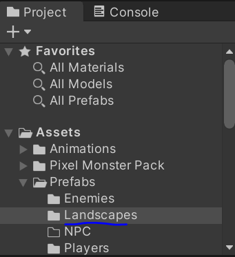

#### Using a Pre-made Landscape 
- The `Landscapes` folder has many different landscapes you can choose from. Drag your favorite landscape into the Scene Hierarchy (All colliders are already set up for you).

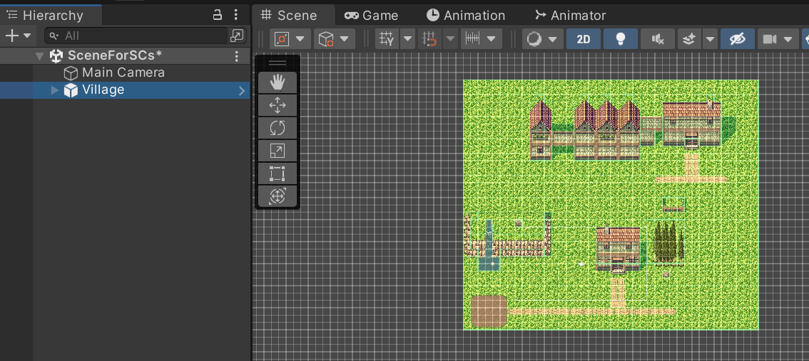

#### Making Your Own Landscape

4. Within the `Landscapes` folder, locate the prefab named `YourLandscape` and drag it into the Scene Hierarchy. This is a grid where you can draw your own landscape for your level.

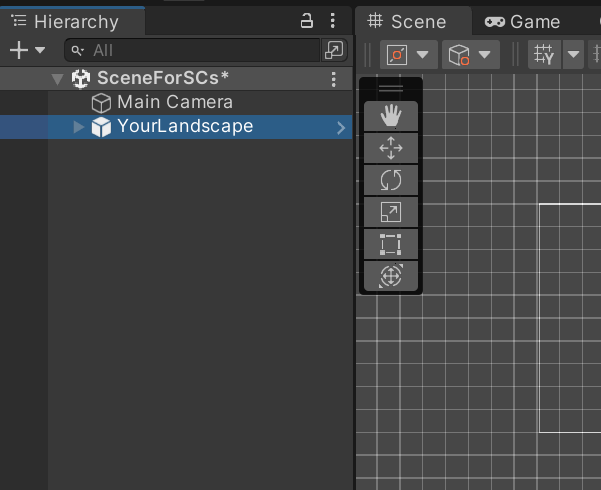

5. Look at the top of the screen and click the `Window` menu button. From there, click on the `2D` button, then within that menu click on `Tile Palette`. This is the window that helps you draw your own landscape. Drag the `Tile Palette` window to the side so that the Scene view is visible.

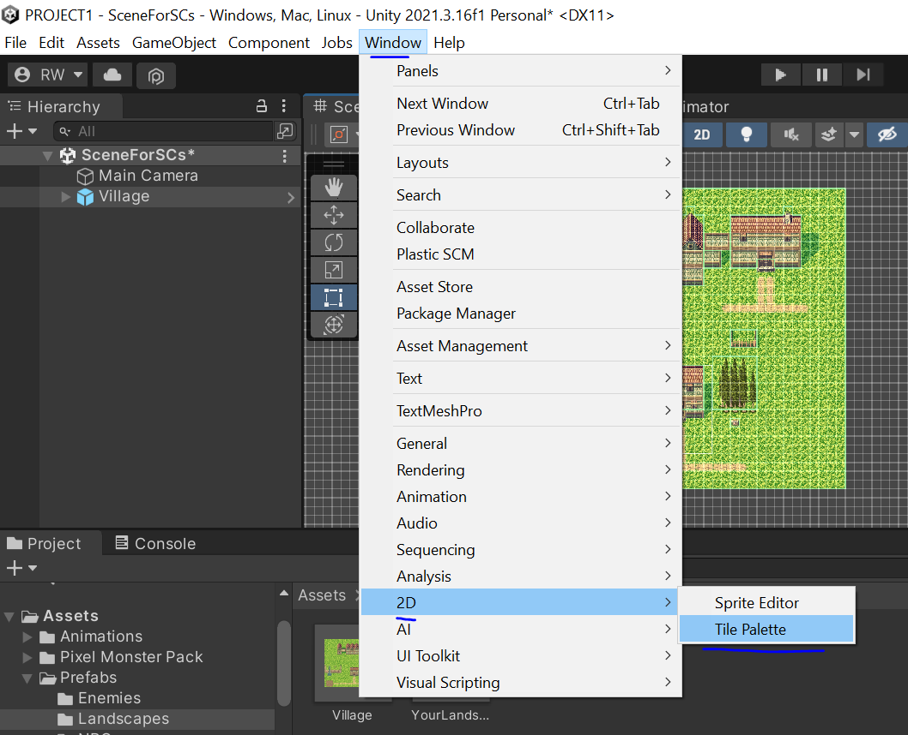

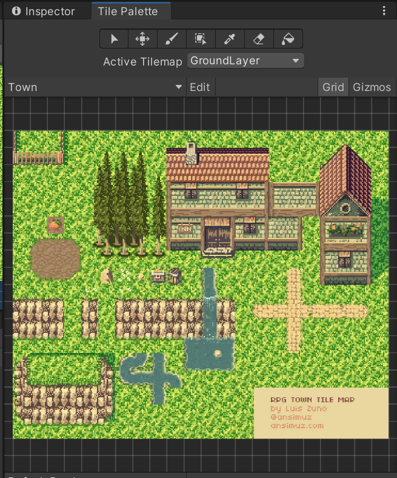

6. Within the `Tile Palette` window, the dropdown menu next to the text `Active Tilemap` tells you which layer you are drawing in. Within that dropdown menu, select `GroundLayer`. If a Window called "Open in Prefab Mode" opens up, select "Prefab Mode".

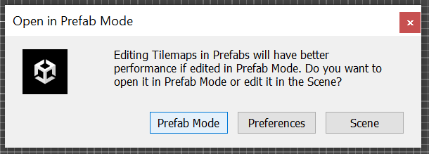

7. Now, click on the paint brush icon.

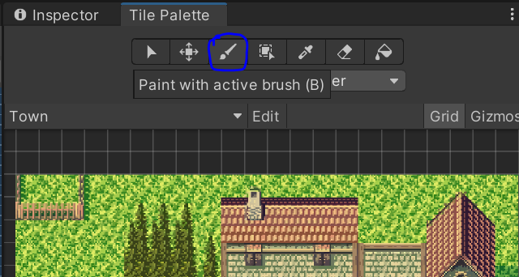

8. Within the `Tile Palette` window, select a portion that you want to use in your level (preferably something that would be considered the Ground).

For example:
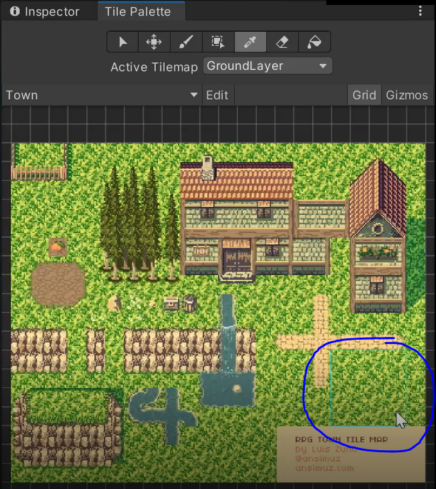

9. Once you have selected a portion, start drawing on the Scene view however you see fit. Be creative! If you make a mistake, you can use the eraser tool.

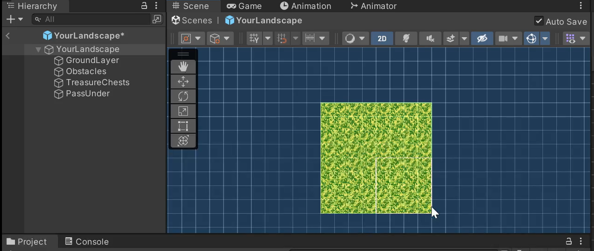
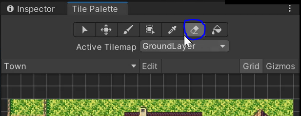

10. When you think you are done drawing in this Tilemap, change the `Active Tilemap` to `Obstacles`. Try to select a portion of the Tilemap that is an obstacle. Then start drawing on the Scene view.

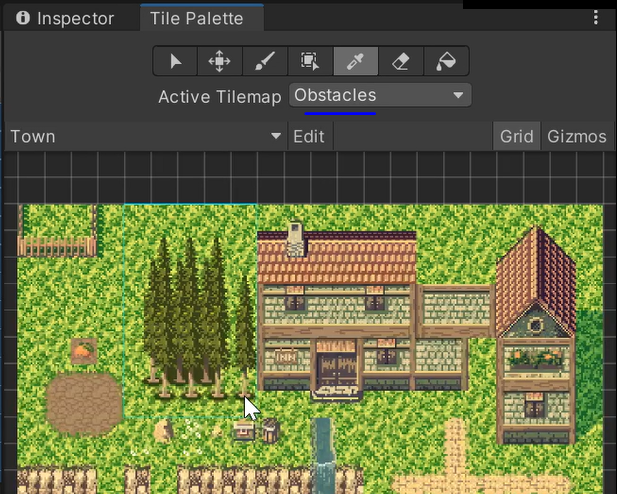

11. Optionally, you can change the `Active Tilemap` to `PassUnder`. This Tilemap is where you think the player can pass under like a bridge. However, this layer can be difficult because you would have to make sure that there is a filled in `Ground Layer` underneath the section you want there to be a `PassUnder`. This is so that the colliders do not conflict each other, and there would be complexities to fix.

If you think you are done with your landscape, Congratulations! You just created your own landscape! This is an example end product:

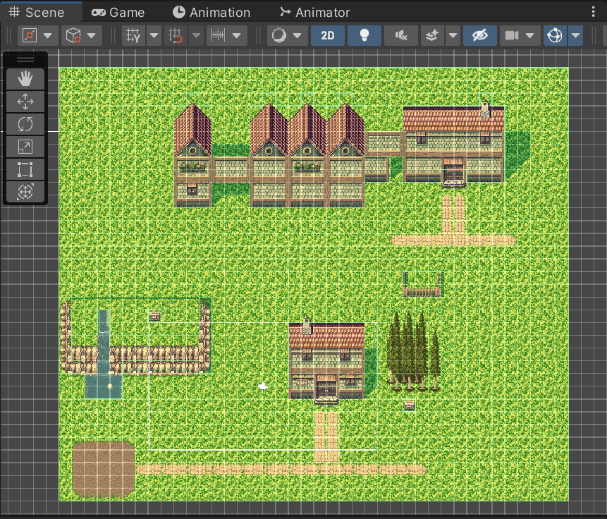

## Adding Main Character

1. Open the `Assets` folder if it is not already opended.
2. Within the `Assets` folder, open the `Prefabs` folder.
3. Within the `Prefabs` folder, open the `Players` folder.

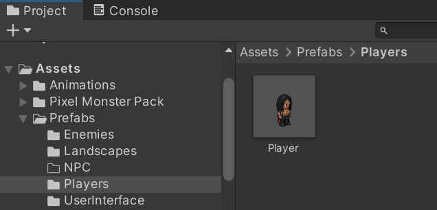

4. Select your favorite player, and drag them into the Scene Hierarchy.

5. In the Scene Hierarchy, rename the player to `Player` if applicable. This is so the built-in scripts can work normally.

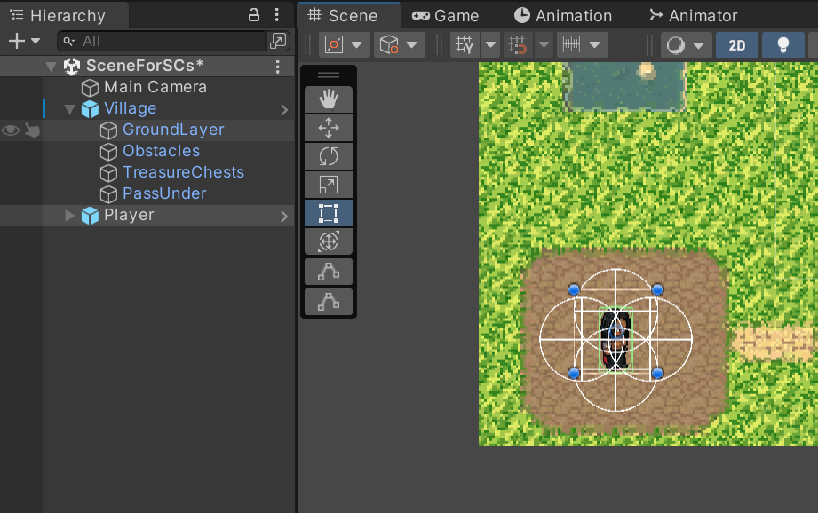

6. In the Scene Hierarchy, drag the Game Object named `Main Camera` onto the Player to make it its child. This makes sure the camera follows the player when it moves around.

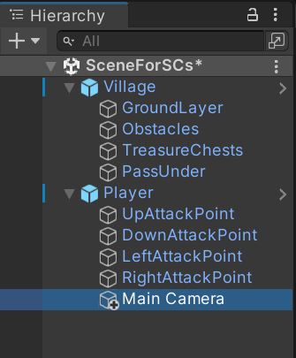

## Adding Enemies

1. Open the `Assets` folder if it is not already opended.
2. Within the `Assets` folder, open the `Prefabs` folder.
3. Within the `Prefabs` folder, open the `Enemies` folder.

4. Select your favorite enemy, and drag them into the Scene Hierarchy.

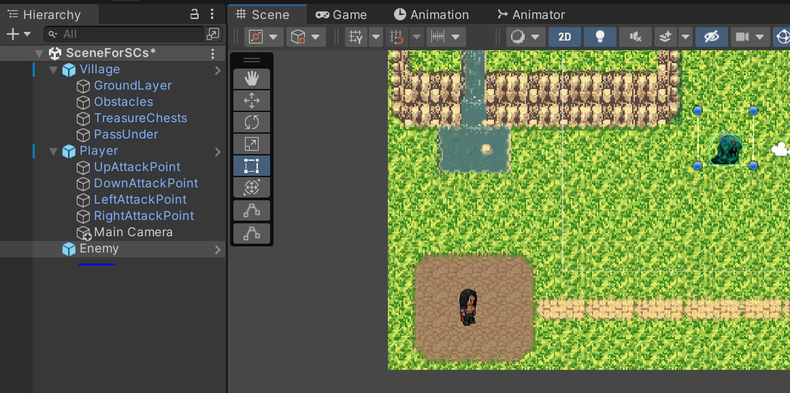

## Adding Loot

TODO

## Adding Treasure Chests

TODO

## Sprites Set-Up

Do the following while the `Player` or `Enemy` game object you want to set up is selected in the Scene Hierarchy:

1. Set the position of `Player` and/or `Enemy` within the bounds of your `Landscape`. You can do so by first selecting the `Player` or `Enemy` object in the Scene Hierarchy, then using the `Move Tool` within the Scene Window, dragging the `Player` into place.

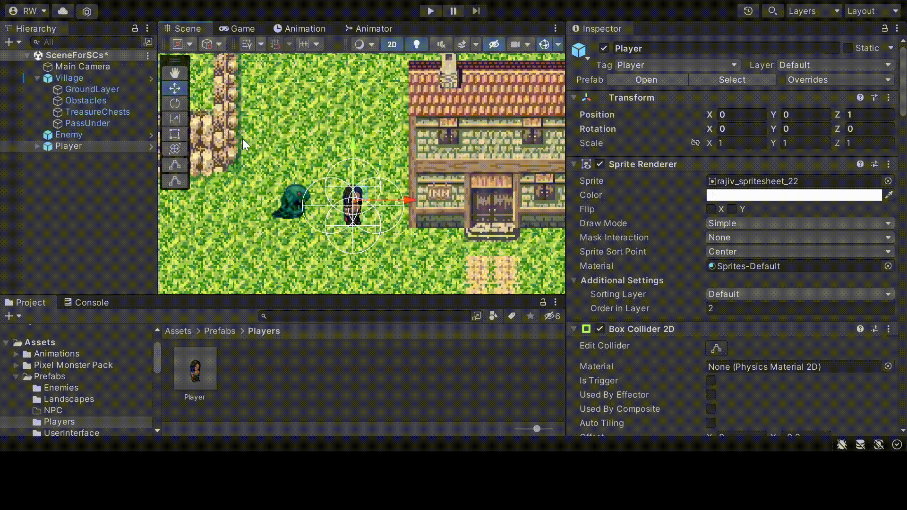

2. The `Box Collider 2D` component will be used for when the character runs into walls, obstacles, etc. Click the "Edit Collider" icon. Here, you can adjust the size of the collider. Ideally, adjust the collider shape to match the size of your Sprite.

3. The `Capsule Collider 2D` component will be triggered when the the Player run into Enemies. click the "Edit Collider" icon. Here, you can adjust the size of the collider. Ideally, adjust the collider shape to match the size of your Sprite.

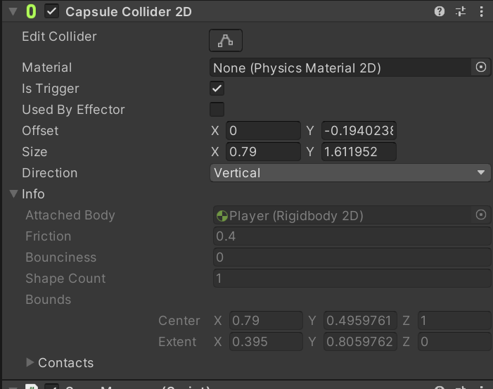

### Player Sprite

The following instructions apply to the `Player` game object only:

1. While the `Player` game object is selected, in the "Inspector" window, change its Tag to "Player". Click "Add Tag" if the tag is not already there.

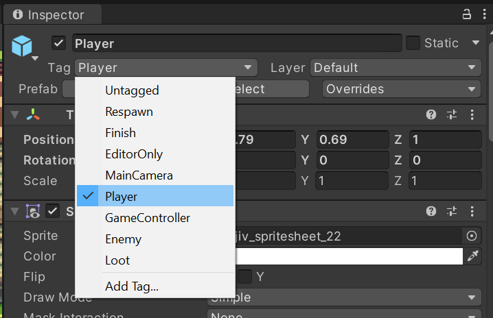

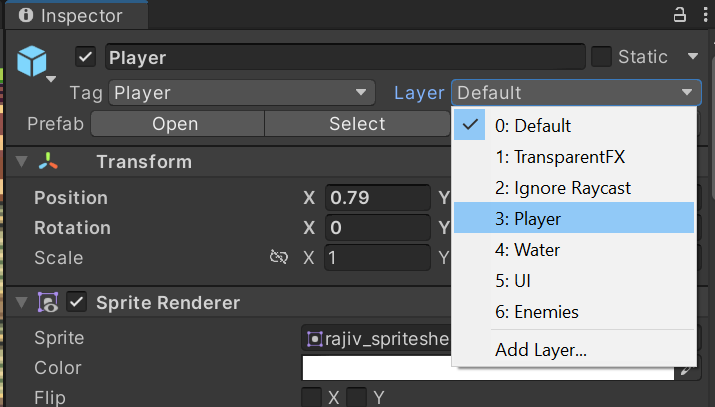

2. In the `Player` script component, set the values however you would like. Recommended values are as follows:
- "Default Attack" = 25
- "Default Defense" = 10
- "Max Health" = 100
- "Player Score" = 0

Also, to set the "Starting Position" of the Player, navigate to the `Scriptable Objects` folder in the `Assets` folder. You will find the `PlayerPosition` asset. 

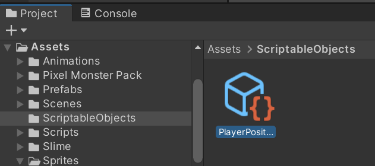

Drag this into the slot of the "Starting Position" for the `Player` script. This will allow the player to maintain the same position when entering and exiting `DoorWay` game objects. (Note: This should be done for every scene the `Player` is in)

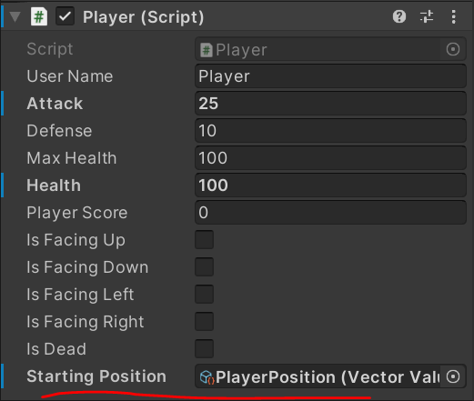

3. Locate the `Player Input` script component, set the "Run Speed" to 3. Feel free to adjust this if you would like.

4. Locate the `Inventory` script component, this is where you store items such as armour, weapons, healing potions, etc.

5. Locate the `Dealing Damage` script component, set "Attack Range" to 1. Set "Enemy Layers" to "Enemies". The `UpAttackPoint`,`DownAttackPoint`, `LeftAttackPoint` and `RightAttackPoint` are where the player can attack in all directions.

6. In the `Save Manager` script component, you can save the details about the Player's progress in the game.

7. The `UI Controls` script component, allows the Player to control the User Interface, like pausing the game, showing inventory, etc.

8. The `Inventory` script component stores the equipment that a Player has acquired or equipped.

### Enemy Sprite

The following instructions apply to the `Enemy` game object(s) only:

1. While the `Enemy` game object is selected check the "Inspector" window. Change its Tag to "Enemy". Click "Add Tag" if the tag is not already there.

2. Change the `Enemy` game object's "Layer" as "Enemies". Click "Add Layer" if the tag is not already there.

3. In the `Enemy` script component, set the values however you would like, especially the "Enemy Name". Default values are as follows:
- "Attack" = 40
- "Defense" = 5
- "Max Health" = 50
- "Health" = 0
- "Number Of Lives" = 1
- "Value" = 100 (The amount added to Player Score when defeated)

4. In the `Enemy Movement` script component, drag the `Player` game object into the "Player" value for the component (This is what the Enemy will follow and try to defeat). Set Movement Speed to 1. Set Hostile Radius to 7. You can adjust the values of these fields if you want.

5. In the `Enemy Spawning` script component, set "Time To Respawn" to 20, or any integer value you want.

## In-Game Menus / Interfaces

Each `Player` prefab has a built-in `InGameMenus` in it. You will see a bunch of the menus layered on top of each other. In Game Mode, they will only be shown if the `Player` toggles them.

### Pause Menu Customization

TODO

### Death Screen Customization

TODO

### Heads Up Display (HUD)

- Within the `UserInterface` folder, locate the prefab called `HUD` and drag it into the Scene Hierarchy.

If you want to see the rest of the scene more easily, make the `InGameMenus` game object inactive.

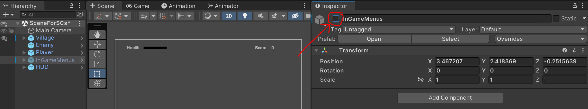

## Main Menu

1. In the Project window, open the `Assets` folder if it is not already opended.
2. Within the `Assets` folder, open the `Scenes` folder.

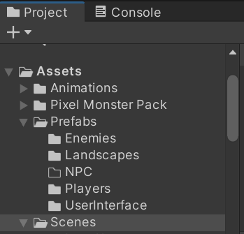

3. Within the `Scenes` folder open the `YourScenes` folder. Right-click on an empty space in the folder and create a new Scene. Name it as `Main Menu`.

4. Double click on the `Main Menu` Scene to open it. 
5. In the Project window, open the `Assets` folder if it is not already opended.
6. Within the `Assets` folder, open the `Prefabs` folder.
7. Within the `Prefabs` folder, open the `UserInterface` folder.

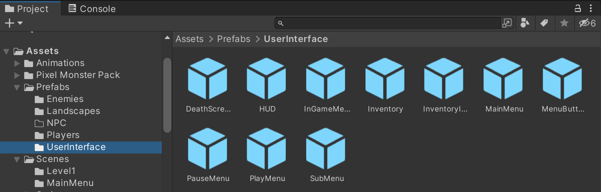

8. Within the `UserInterface` folder, locate the prefab called `MainMenu`. Drag `Main Menu` into the Scene Hierarchy.

9. Within the Scene Hierarchy, open the children of `MainMenu` and locate `MenuInterface`. Open the children of `MenuInterface` and select the `Background` game object. 

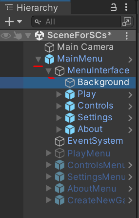

10. In the "Inspector" window, locate the Image component. You can customize the Image of the background of the main menu, or change the color. Be creative!

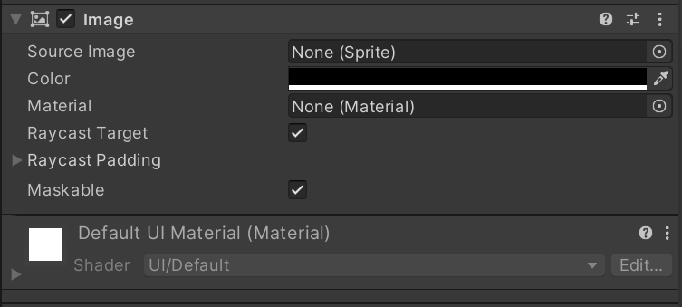

## Door Ways (Complex)

Door Ways in the context of this project allow you to enter and exit buildings and go to different Scenes in a level. In the titles of the instructions, the place a `Player` is coming from is referred to as an `Entry Way` while the place a `Player` is entering is referred to as a `Destination`.

In these instructions, you will need to store the positions of an `Entry Way` and a `Destination` in different Scenes so that the `Player` starting position makes sense when entering and exiting a `DoorWay`. 

### Getting the Player Starting Position In Entry Way

1. Make sure to open the Scene that you want to make the `DoorWay` in.

2. In the Project window, open the `Assets` folder if it is not already opended.
3. Within the `Assets` folder, open the `Prefabs` folder.
4. Within the `Prefabs` folder, open the `DoorWays` folder.

5. Within the `DoorWays` folder, locate the prefab named `DoorWay` and drag it into the Scene Hierarchy. You can rename it to whatever you would like. This game object will be used at entrances and exits throughout your landscape, if you have buildings with doors, or entrance ways to new scenes.

6. Move your `DoorWay` where you would like it to be (position it in an entrance way). Make note of the X and Y values of the `Transform` component. These are the values you will use to store the position of `OutsideDoorWay`, which will be something we can use to store the position (More Details in Step 12).

7. While the `DoorWay` game object is selected, look in the "Inspector" window. In the `Door Way` script component, set the "Player" to the `Player` game object currently in the Scene Hierarchy.

8. In the Project window, open the `Assets` folder if it is not already opended.
9. Within the `Assets` folder, open the `ScriptableObjects` folder.
10. Within the `ScriptableObjects` folder, open the `YourDoorWays` folder.

11. Within the `YourDoorWays` folder, create a new folder and name it the place the `Player` is entering. For example, if you were entering your house, you would name the folder as `MyHouse`. Open the folder you just created.

12. Within this folder, create a new `VectorValue` Scriptable object. This is where you will store the position of the door way in the scene you want the `Player` to go to. Name this object as `OutsideDoorWay`.

13. While `OutsideDoorWay` is selected, look at the "Inspector" window. The "Initial Value" should be the coordinates (X and Y) of the outside of the door way in the current Scene. Enter the X and Y values you noted from the `DoorWay` game object in the current Scene.

14. Navigate to the `ScriptableObjects` folder and open the `PlayerPosition` folder inside of it. Locate the `PlayerPosition` scriptable object and drag it into the "Player Position In Current Scene" value in the `Door Way` script component of the `DoorWay` game object.

15. To get the "Player Position in Destination" value for the `Door Way` script component, you must follow the steps for `Setting Up Destination Scene`. When the Vector Value is made for the Destination Scene, then you are able to set this value.

### Setting Up Destination Scene

1. In the Project window, open the `Assets` folder if it is not already opended.
2. Within the `Assets` folder, open the `Scenes` folder.
3. Within the `Scenes` folder, open the `YourScenes` folder. In this folder, you can do either of the following: 
- Create a new Scene. Right-click on an empty space in the folder and create a new Scene. Name it whatever you would like. For example, if you were entering your house you would name it `MyHouse`.
- Locate a Scene that you already made. Make sure that  the Scene is equipped with a `Player`, `Landscape`, `HUD`, `InGameMenus`, and anything else you would like. Then, rename this Scene to whatever you would like. Then, copy the Scene using CTRL-C keyboard shortcut, and then pasting it with CTRL-V. (This method is better since you keep the transition from one Scene to another consistent.)

4. If you made a new Scene, set up the Scene with a `Player`, `Landscape`, `HUD`, `InGameMenus`, and anything else you would like.

5. In the Project window, open the `Assets` folder if it is not already opended.
6. Within the `Assets` folder, open the `Prefabs` folder.
7. Within the `Prefabs` folder, open the `DoorWays` folder.

8. Within the `DoorWays` folder, locate the prefab named `DoorWay` and drag it into the Scene Hierarchy. You can rename it to whatever you would like. This game object will be used at entrances and exits throughout your landscape, if you have buildings with doors, or entrance ways to new scenes.

9. While the `DoorWay` game object is selected, look in the "Inspector" window. In the `Door Way` script component, set the "Player" to the `Player` game object currently in the Scene Hierarchy.

10. Navigate to the `ScriptableObjects` folder and open the `YourDoorWays` folder inside of it. Locate the `OutsideDoorWay` scriptable object and drag it into the "Player Position In Current Scene" value in the `Door Way` script component of the `DoorWay` game object. `OutsideDoorWay` is the `Destination` of the current Scene.

12. Navigate to the `ScriptableObjects` folder and open the `PlayerPosition` folder inside of it. Locate the `PlayerPosition` scriptable object and drag it into the "Player Position In Current Scene" value in the `Door Way` script component of the `DoorWay` game object.

### Getting the Player Starting Position In Destination

1. In the Project window, open the `Assets` folder if it is not already opended.
2. Within the `Assets` folder, open the `ScriptableObjects` folder.
3. Within the `ScriptableObjects` folder, open the `YourDoorWays` folder.

4. Within the `YourDoorWays` folder, open the folderthe place the `Player` is entering. For example, if you were entering your house, you would name the folder as `MyHouse`. Open the folder you just created.

5. Open the same folder that `OutsideDoorWay` is stored in.Within this folder, create a new `VectorValue` Scriptable object. This is where you will store the position of the door way in the scene you want the `Player` to go to. Name this object as `InsideDoorWay`.

6. While `InsideDoorWay` is selected, look at the "Inspector" window. The "Initial Value" should be the coordinates (X and Y) of the inside of the door way within the destination Scene.

7. Open the Scene which is considered the `Destination` for the `DoorWay` that you want the `Player` to go to from if it is not already opened. Click on the `DoorWay` game object in the Scene Hierarchy. Make note of the X and Y values of the `Transform` component. These are the values you will use for `InsideDoorWay`

8. Go back to the folder in the `YourDoorWays` folder where you have the `InsideDoorWay` scriptable object. Enter the X and Y values you noted from the `DoorWay` game object in the current Scene. This will be used for the `DoorWay` game object of the other Scene you are coming from when entering this `DoorWay`

9. Navigate to the `ScriptableObjects` folder and open the `PlayerPosition` folder inside of it. Locate the `PlayerPosition` scriptable object and drag it into the "Player Position In Current Scene" value in the `Door Way` script component of the `DoorWay` game object.

10. Next, drag the `OutsideDoorWay` scriptable object into the "Player Position in Destination" value of the `Door Way` script component of the `DoorWay` game object.

11. Now, open the Scene that is considered the `Entry Way` for this `DoorWay`.

12. Select the `DoorWay` game object. Notice that the "Player Position in Destination" value is missing.

12. Go back to the folder in the `YourDoorWays` folder where you have the `InsideDoorWay` scriptable object. Locate the `InsideDoorWay` scriptable object. Drag this into the "Player Position in Destination" value in the `DoorWay` script component of the `DoorWay` game object.

Congratulations! You just made your own `DoorWay`! In game, the character can enter this `DoorWay` by pressing the `Attack` button (Spacebar).